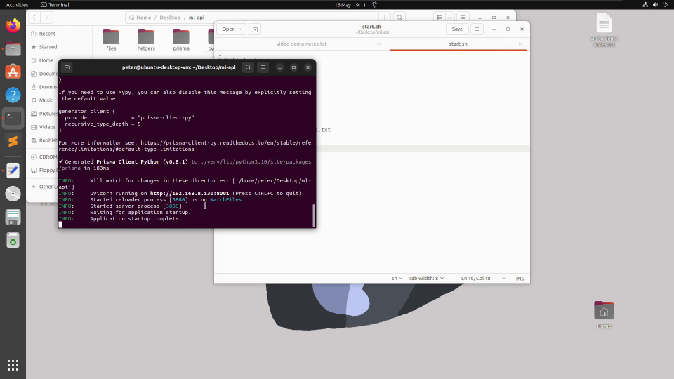
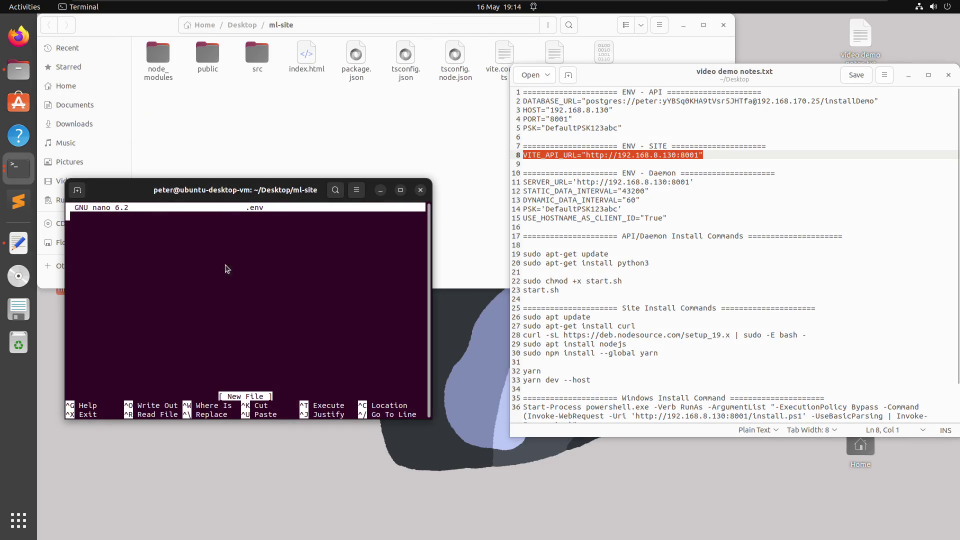
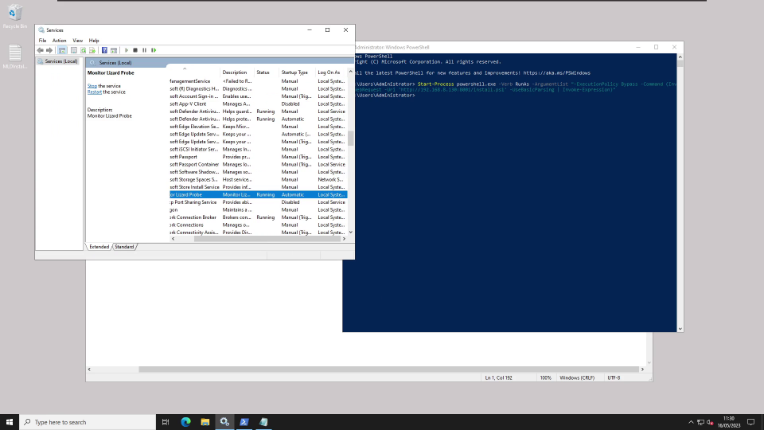
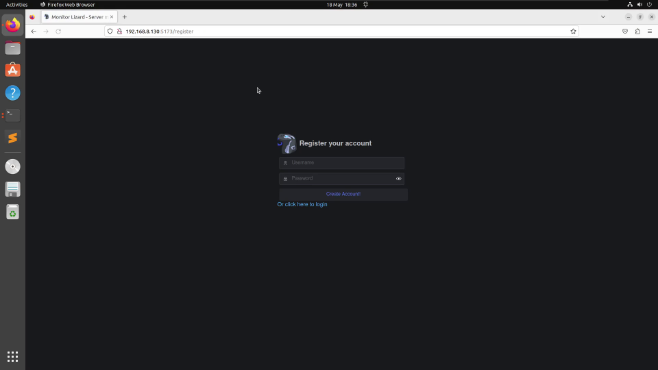

  

# Introduction
Monitor Lizard is a server monitoring software that is comprised of three components: a Windows or Linux daemon running on the client, an API and database backend, and a web frontend to visualize the data. Monitor Lizard was created as part of a group project.

More information can be found in the `Docs` folder and demonstrations can be found in the `Videos` folder.

# Demo Videos

## Installing the API

## Installing the Front End

## Installing Client Daemons

## Product Demo

# Documentation

- [Client Feature Overview](Docs/Client%20Feature%20Overview.pdf)
- [Coversheet](Docs/Coversheet.pdf)
- [Install Guide](Docs/Install%20Guide.pdf)
- [Testing Documentation](Docs/Testing%20Documentation.pdf)

# Installation Guide

1. `yarn global add turbo`
2. `turbo build` (if this command errors saying command turbo not found, restart PC)
3. Configure `.env` files in each of the directories in `apps` (see `.env-templates`)
4. `turbo dev`
